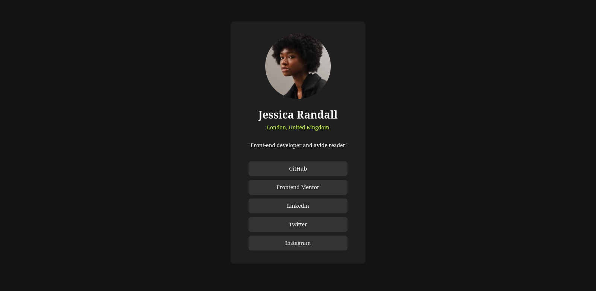

# Frontend Mentor - Social links profile solution

This is a solution to the [Social links profile challenge on Frontend Mentor](https://www.frontendmentor.io/challenges/social-links-profile-UG32l9m6dQ). Frontend Mentor challenges help you improve your coding skills by building realistic projects.

## Table of contents

- [Overview](#overview)
  - [The challenge](https://www.frontendmentor.io/challenges/social-links-profile-UG32l9m6dQ)
  - [Screenshot](./assets/images/Screenshot.png)
  - [Links](#links)
- [My process](#my-process)
  - [sass/scss](https://sass-lang.com/)
  - [Variable Fonts](https://fonts.google.com/knowledge/introducing_type/introducing_variable_fonts)
  - [Modzilla Developper Network](https://developer.mozilla.org/en-US/)
- [Salim Touré](https://github.com/limsael)

## Overview

### The challenge

Users should be able to:

- See hover and focus states for all interactive elements on the page

### Screenshot



### Links

- Solution URL: [Solution URL](https://your-solution-url.com)
- Live Site URL: [Live Site URL](https://limsael.github.io/social-links-profile/)

## My process

### Built with

- Semantic HTML5 markup
- Flexbox
- CSS Grid
- Mobile-first workflow

### What I learned

```css
a {
  display: inline-block;
  width: 100%;
  margin-block: 5px;
  padding: 10px;
  background-color: $grey;
  color: $white;
  border-radius: 8px;
  transition: background-color 0.5s ease-in-out, color 0.5s ease-in-out;

  &:hover {
    background-color: $green;
    color: $black;
  }
}
```

### Continued development

- The Link Tree
- The picture

### Useful resources

- [MDN](https://developer.mozilla.org/en-US/) - This helped me for CSS Grid & CSS Flexbox.
- [Google Fonts](https://fonts.google.com/knowledge/introducing_type/introducing_variable_fonts) - This is an amazing article which helped me finally understand variable fonts. I'd recommend it to anyone still learning this concept.

## Author

- Frontend Mentor - [@limsael](https://www.frontendmentor.io/profile/limsael)
- Twitter - [@limsael525](https://www.twitter.com/limsael525)
